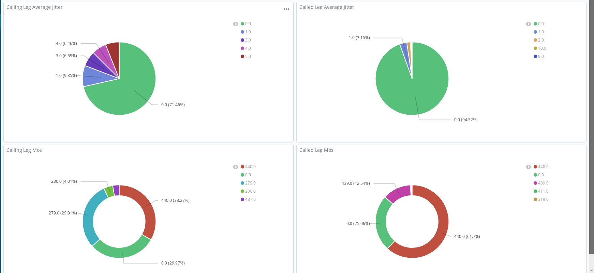
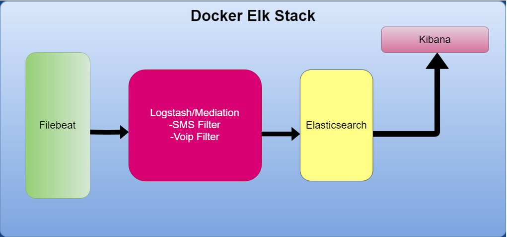
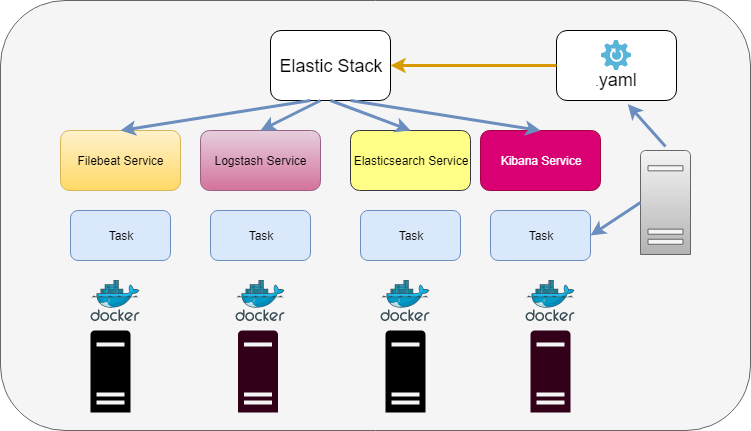

# CDR Analysis for Telecom Business based on Elastic Stack

In this project, I will propose a monitoring solution for Telecom services based on CDRs. 

CDRs or otherwise call detail records to hold specific information for traffic such as **VoIP, Data, SMS**. 

This event-driven solution can be used to monitor network service status proactively. We expect that at any given point, the data type should fall under specific values, and have a particular volume. For example, **packet loss at any given time should be <1 %**. The state of the network services is a sum based on a cumulative formula. These are "datapoint/point-features."
Will focus on:




* EPC SMS/DATA Traffic

* VoIP Traffic At the most simplistic level to ensure proper network operation, we must certain percentage of traffic is successful. In regular network operations, we can expect that a certain percentage of traffic is unsuccessful. When levels fall under a % threshold, a notification is sent.

### Architecture Design

We use Elastic stack components to set up the infrastructure. Each component executes a specific task below we can see a breakdown.



Stack is deployed based on deployment.yml file. Within this file we define each **service, number of replicas, failure scenario, ports, volumes etc**.

### Docker Elastic Services Stack



```
version: '3'services:
   elasticsearch:
     image: docker.elastic.co/elasticsearch/elasticsearch:6.8.0
     container_name: elasticsearch
     volumes:
       - 'esdata_4cdr:/usr/share/elasticsearch/data'
     ports: ['9200:9200']
     networks:
       - dockerelk_cdr
     restart: on-failure
     deploy:
      mode: replicated
      replicas: 2
      placement:
        constraints: [node.role == worker]
   logstash:
    image: docker.elastic.co/logstash/logstash:6.8.0
    container_name: logstash_cdr
    networks:
      - dockerelk_cdr
    volumes:
      - ./logstash/config:/etc/logstash/conf.d
    command: /usr/share/logstash/bin/logstash -f /etc/logstash/conf.d/logstash.conf    
    ports:
      - "5000:5000"
      - "5044:5044"
    networks:
      - dockerelk_cdr
    depends_on:
      - elasticsearch
    restart: on-failure 
   kibana:
    image: docker.elastic.co/kibana/kibana:6.8.0
    container_name: kibana_cdr
    #volumes:
    #  - ./kibana/kibana.yml:/usr/share/kibana/config/kibana.yml:ro
    ports:
      - "5601:5601"
    networks:
      - dockerelk_cdr
    depends_on:
      - elasticsearch
    restart: on-failure
    deploy:
      replicas: 1
      placement:
        constraints: [node.role == worker]
   filebeat:
    image: docker.elastic.co/beats/filebeat:6.8.0
    container_name: filebeat_cdr
    command: filebeat -e -strict.perms=false
    volumes:
      - ./filebeat/config/filebeat.yml:/usr/share/filebeat/filebeat.yml:ro
      - ./sample_data:/usr/share/filebeat/logs
    networks:
      - dockerelk_cdr
    deploy:
      mode: replicated
      replicas: 2
    depends_on:
      - elasticsearch
    restart: on-failurenetworks:
  dockerelk_cdr:
    driver: overlay
volumes:
  esdata_4cdr:
    driver: local
  ```

The same file can be used to deploy the stack locally with docker-compose.
Within project structure we define each component and it's functionality:


Component | Description
---|---|
Filebeat | lightweight process that ships log data
Logstash | Aggregation/Mediation layer
Elasticsearch | Nosql DB/Backend where we store the data
Kibana | Web gui

### Project Structure

```
├── docker-compose_stash.yml
├── get-docker.sh
├── Images
│   ├── docker_elkstack.png
│   ├── droppelets.png
│   ├── elk_stack.png
│   ├── sms_classification.PNG
│   ├── traffic_lan.png
│   └── Voip_Classification.PNG
│   ├── Voip/
│   ├── SMS/
├── Infrastructure
│   ├── docker-compose_stash.yml
│   ├── filebeat
│   │   ├── config
│   │   │   ├── filebeat.yml
│   │   └── Dockerfile
│   ├── get-docker.sh
│   ├── kibana
│   │   └── kibana.yml
│   ├── logstash
│   │   └── config
│   │       ├── logstash.conf
│   │       └── logstash_sms.conf
│   └── sample_data
│       ├── sms/
│       └── voip/
└── README.md

```


Based on a small data sample will create a bigger dataset using sample points.

    Dataset will be created using scikit learn library
    Data will thread based on regular daily traffic with an expect increased till mid-day
    We can use data_sample.csv for datapoints
    The other relevant info will be created to match the datapoint in a one-to-one relation, and distribution will be created based on the desired percentage. For instance, 80% of SMS will be MO
